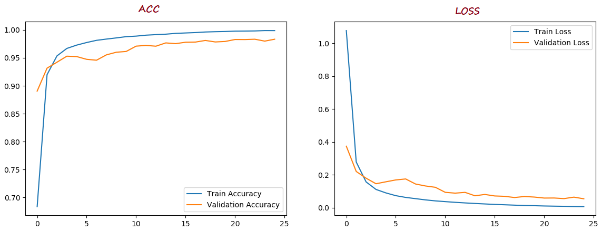

# Python-CNN-Classification-Mnist

</img>

<strong> Digit (mnist dataset) detection using CNN model. </strpng>

Dataset used :

Mnist

The mnist_train.csv file contains the 60,000 training examples and labels. The mnist_test.csv contains 10,000 test examples and labels. Each row consists of 785 values: the first value is the label (a number from 0 to 9) and the remaining 784 values are the pixel values (a number from 0 to 255).

About Dataset

<ul>
  <h3> The dataset consists of two files: </h3>

<ol> mnist_train.csv</ol>

<ol> mnist_test.csv</ol>

</ul>

### Result
</img>

You can have this dataset from : https://www.kaggle.com/oddrationale/mnist-in-csv 
